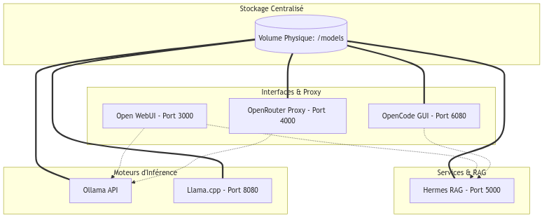

# IA Locale, Open Source et Agents RAG 🚀 (Version Stack Podman)

Présentation technique réalisée pour **3W Québec** à l'**UQAM** le **23 Avril 2026**.

## 📝 Description du Projet
Infrastructure IA modulaire et souveraine. Chaque service est un conteneur Podman indépendant, tous reliés à un dossier de modèles centralisé et un réseau privé.

## 🏗️ Schéma d'Architecture Global

<p align="center">
  
</p>

> **Souveraineté :** L'accès direct au volume `/models` garantit que chaque outil travaille sur la même base de connaissance locale sans duplication.

## 🛠️ Détail des Services
- **Ollama** : Moteur d'inférence simplifié.
- **Llama.cpp** : Serveur haute performance pour fichiers GGUF (avec support entraînement et logs).
- **Hermes RAG** : Pipeline de Retrieval Augmented Generation (système basé sur Marimo).
- **Open WebUI** : Interface utilisateur unifiée (Port 3000).
- **OpenCode-GUI** : IDE assisté par IA (Port 6080).
- **OpenRouter-Proxy (LiteLLM)** : Hub central pour l'orchestration des modèles (Port 4000).
- **IA Homepage** : Point d'entrée unique (Port 8080).

## 📂 Structure du Projet
- `ollama/`, `llamacpp-gui/` : Configurations et documentations spécifiques aux moteurs.
- `script-interaction-model/` : Écosystème **Python (uv)** pour interagir avec les API (Ollama, HF, LangChain).
- `models/` (externe) : Volume partagé mappé en `:rw`.
- `logs/`, `training/`, `data_io/` : Dossiers de travail pour l'entraînement et le debug.

## 🛠️ Outils d'automatisation
- **`add_model.sh`** : Script interactif pour ajouter des modèles à Ollama ou llama.cpp.
- **`uv`** : Gestionnaire de paquets ultra-rapide pour les scripts Python d'interaction.

## 🚀 Lancement Rapide
```bash
# Lancer la stack complète
podman-compose up -d

# Accéder à la page d'accueil unifiée
# http://localhost:8080
```

---
*Documentation comparative disponible dans `docker_model_runner_vs_podman.md`.*
