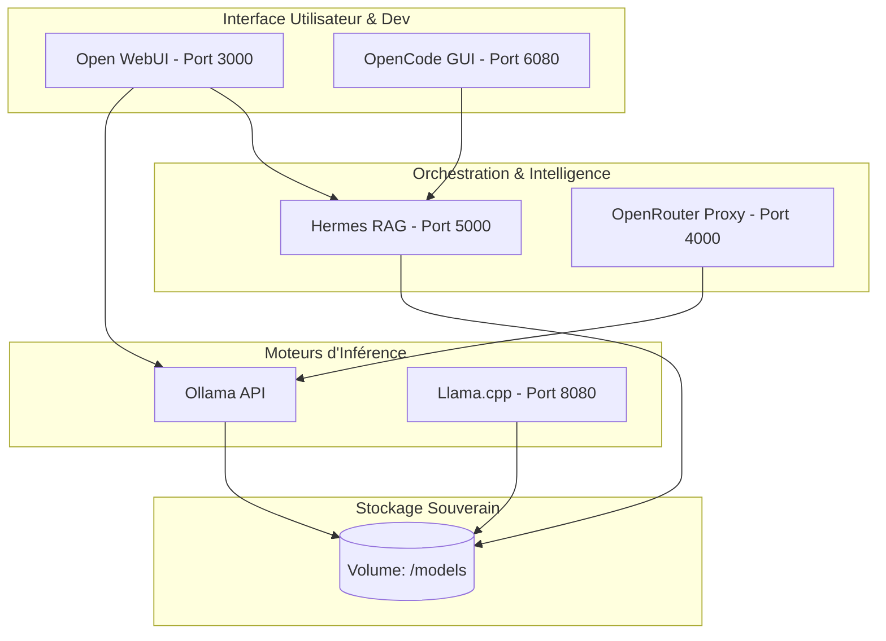

# IA Locale, Open Source et Agents RAG 🚀 (Version Stack Podman)

Présentation technique réalisée pour **3W Québec** à l'**UQAM** le **23 Avril 2026**.

## 📝 Description du Projet
Ce dépôt est une infrastructure IA souveraine orchestrée par **Podman**. Il permet de faire tourner des LLMs localement, d'automatiser des tâches via des agents, et d'utiliser un système de RAG (Retrieval-Augmented Generation) pour interroger vos propres documents.

## 🏗️ Schéma d'Architecture Global



> **Note :** Tous les services communiquent via le réseau isolé `ai-net` de Podman.

## 🛠️ Services Inclus
1.  **Ollama** : Backend principal pour l'exécution des modèles (GGUF, Safetensors).
2.  **Open WebUI** : Interface de chat moderne et gestion du RAG.
3.  **Hermes RAG** : Moteur de connaissance basé sur vos documents locaux.
4.  **OpenCode GUI** : Environnement de développement accessible par navigateur (VNC).
5.  **Llama.cpp** : Inférence haute performance optimisée pour le format GGUF.
6.  **OpenRouter Proxy** : Passerelle unifiée pour le routage des requêtes.

## 🏛️ Architecture des Agents IA
Voici une visualisation stylisée de l'interaction des agents :

<p align="center">
  
</p>

## 🚀 Déploiement
1. **Pré-requis** : Podman et Podman-Compose installés.
2. **Lancement** :
   ```bash
   podman-compose up -d
   ```
3. **Administration** : Pilotez vos conteneurs sur [http://localhost:9090](http://localhost:9090) (Cockpit).

---
*Refactorisation effectuée pour optimiser la souveraineté des données et la légèreté des outils.*
